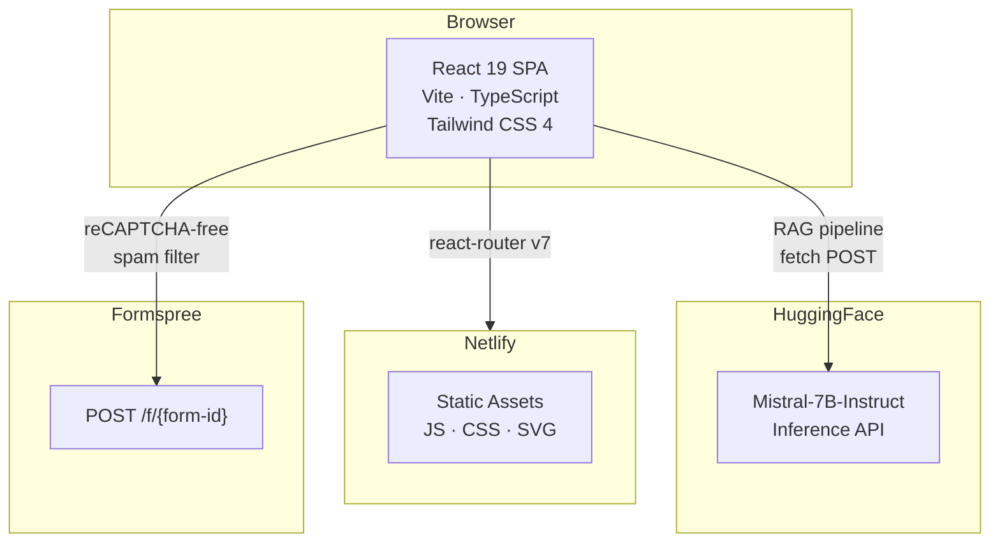
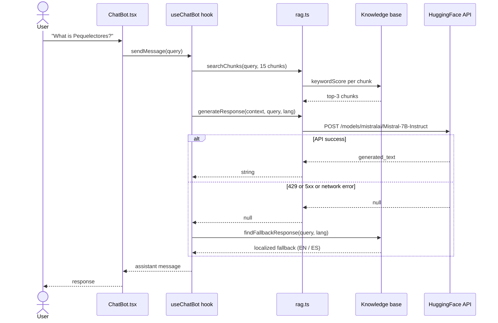
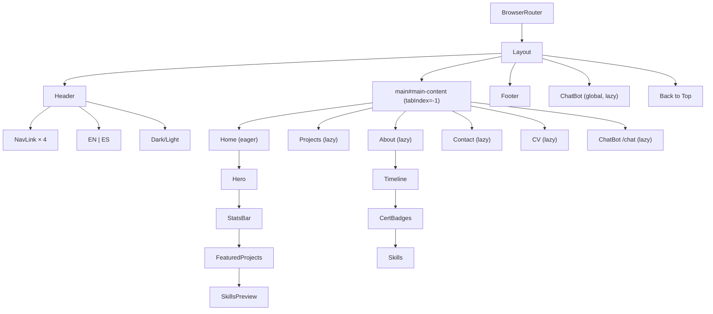

# jdvalmart-dev

**Juan David Valencia** — AI Engineer & ML Engineer

[](https://jdvalmartdev.netlify.app)
[](https://www.typescriptlang.org/)
[](https://react.dev/)
[](https://tailwindcss.com/)
[](https://vite.dev/)
[](https://www.python.org/)

Portfolio + AI chatbot for an engineer specializing in NLP, Transformers, and Explainable AI (XAI).

**[jdvalmartdev.netlify.app](https://jdvalmartdev.netlify.app/)**

---

## Architecture



---

## Project structure

```
jdvalmart-dev/
├── frontend/                       # React 19 · TypeScript · Vite
│   ├── src/
│   │   ├── components/             # UI: Layout, Hero, ChatBot, Timeline, Skills…
│   │   ├── pages/                  # Home, Projects, About, Contact, CV
│   │   ├── routes/                 # Lazy-loaded route definitions
│   │   ├── hooks/                  # useChatBot, useDarkMode, useScrollReveal
│   │   ├── services/rag.ts         # Keyword retrieval + HuggingFace API
│   │   ├── data/                   # Knowledge base, projects, timeline, certs
│   │   └── i18n/                   # EN/ES translations + LanguageContext
│   ├── public/
│   ├── index.html                  # Open Graph, Twitter Card, JSON-LD
│   ├── vite.config.ts
│   ├── vitest.config.ts
│   └── package.json
│
├── backend/                        # [Phase 2] FastAPI RAG microservice
│   ├── src/
│   │   ├── routers/
│   │   ├── services/               # embeddings · vector_store · rag · llm
│   │   └── data/chunks.json
│   ├── tests/
│   ├── pyproject.toml
│   └── Dockerfile
│
├── netlify.toml
└── README.md
```

---

## How the chatbot works



---

## Components



---

## Features

### AI
- **RAG chatbot** — keyword retrieval over 15 knowledge chunks, Mistral-7B generation, bilingual (EN/ES) static fallback responses
- 13 pattern-matched fallback entries per language

### UX
- Dark mode with system preference detection and `localStorage` persistence
- Full English/Spanish i18n via React Context
- Scroll-triggered counter animations (0 → target at 60 fps)
- IntersectionObserver-based fade-in/slide-in on scroll
- Project category filter (All / AI & ML / Full Stack)
- 5 code-split chunks: `React.lazy()` for Projects, About, Contact, CV, ChatBot

### Contact
- React Hook Form + Zod validation
- Formspree API with automatic mailto fallback when no API key is set
- Loading and error states

### SEO & accessibility
- `react-helmet-async` with per-page `<title>` and `<meta name="description">`
- Open Graph, Twitter Card, JSON-LD structured data in `index.html`
- Skip-to-content link, `aria-expanded` on chatbot toggle, `aria-live="polite"` on messages
- Semantic HTML throughout

---

## Projects

| Project | Type | Live |
|---------|------|------|
| [**Pequelectores**](https://pequeletores.netlify.app) — AI book recommendations for children (TF-IDF + gamification) | AI & ML | [pequeletores.netlify.app](https://pequeletores.netlify.app) |
| [**Bootcamp IA**](https://github.com/jdvalmart/bootcamp-ia-mintic) — 33 ML labs (CNN 87.14%, XAI, NLP) | AI & ML | [GitHub](https://github.com/jdvalmart/bootcamp-ia-mintic) |
| [**Book-Tracker**](https://book-tracker1.netlify.app) — Full-stack library manager (React + FastAPI + PostgreSQL) | Full Stack | [book-tracker1.netlify.app](https://book-tracker1.netlify.app) |

---

## Tech

| Layer | Stack |
|-------|-------|
| Framework | React 19 · TypeScript 5.9 |
| Build | Vite 7 |
| Styling | Tailwind CSS 4 |
| Routing | React Router v7 |
| Forms | React Hook Form + Zod 4 |
| SEO | react-helmet-async |
| Contact | Formspree API |
| AI | HuggingFace Inference API (Mistral-7B-Instruct v0.3) |
| Testing | Vitest 4 · React Testing Library 16 |
| Linting | ESLint 9 · typescript-eslint 8 |
| Deploy | Netlify |

---

## Development

```bash
# clone
git clone git@github.com:jdvalmart/jdvalmart-dev.git
cd jdvalmart-dev/frontend

# install
bun install

# env (optional — chatbot falls back to static responses)
cp .env.example .env

# dev
bun run dev

# type-check
bun run build -- --noEmit

# tests (18 tests · 2 suites · 100% pass)
bun run test

# build
bun run build
```

### Env vars

| Variable | Required | Purpose |
|----------|----------|---------|
| `VITE_HF_API_KEY` | No | HuggingFace token for LLM responses |
| `VITE_FORMSPREE_ID` | No | Formspree form ID for contact submissions |

---

## Roadmap

| Phase | Status | Description |
|-------|--------|-------------|
| **1. Stabilization** | Done | Restructure monorepo, fix RAG pipeline, add CV page, SEO, a11y, code splitting |
| **2. Backend** | Next | FastAPI + sentence-transformers embeddings + ChromaDB vector search + multi-turn history |
| **3. Polish** | Planned | Streaming responses, project detail pages, chat persistence, analytics |

---

## Contact

- **Email** — juanvalencia9411@outlook.com
- **LinkedIn** — [linkedin.com/in/jdvalmart](https://www.linkedin.com/in/jdvalmart/)
- **GitHub** — [github.com/jdvalmart](https://github.com/jdvalmart)
- **HuggingFace** — [huggingface.co/jdvalmart](https://huggingface.co/jdvalmart)
