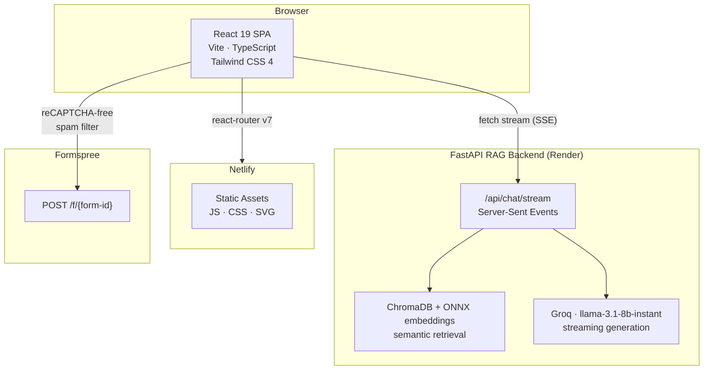
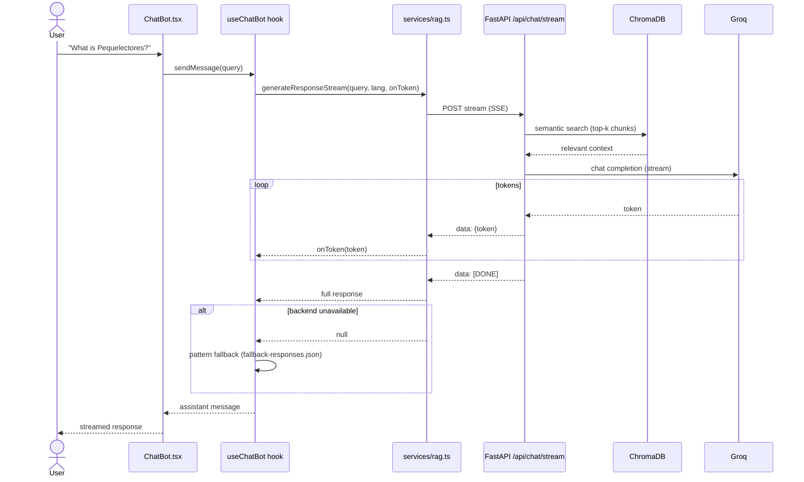
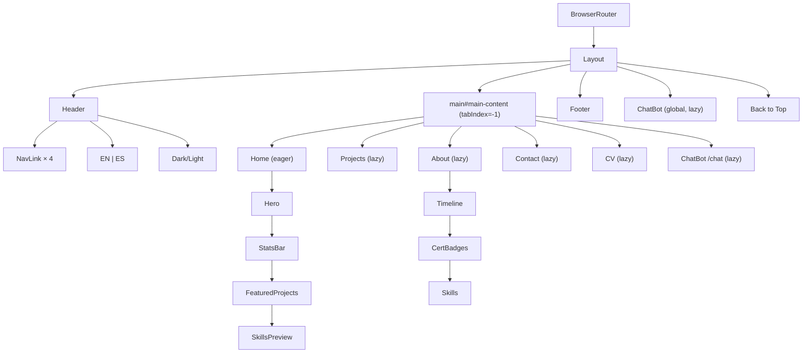

# jdvalmart-dev

**Juan David Valencia** — AI Software Developer · RAG & LLM Engineer

[](https://jdvalmartdev.netlify.app)
[](https://www.typescriptlang.org/)
[](https://react.dev/)
[](https://tailwindcss.com/)
[](https://vite.dev/)
[](https://www.python.org/)

Portfolio and RAG chatbot for an AI Software Developer specializing in Retrieval-Augmented Generation, LLM infrastructure, and MCP (Model Context Protocol).

**[jdvalmartdev.netlify.app](https://jdvalmartdev.netlify.app/)**

---

## Architecture


```mermaid
graph TB
    subgraph Browser["Browser"]
        SPA["React 19 SPA<br/>Vite · TypeScript<br/>Tailwind CSS 4"]
    end

    subgraph CDN["Netlify"]
        Assets["Static Assets<br/>JS · CSS · SVG"]
    end

    subgraph Backend["FastAPI RAG Backend (Render)"]
        ChatAPI["/api/chat/stream<br/>Server-Sent Events"]
        Vector["ChromaDB + ONNX embeddings<br/>semantic retrieval"]
        Groq["Groq · llama-3.1-8b-instant<br/>streaming generation"]
    end

    subgraph Contact["Formspree"]
        FormAPI["POST /f/{form-id}"]
    end

    SPA -->|"react-router v7"| CDN
    SPA -->|"fetch stream (SSE)"| ChatAPI
    ChatAPI --> Vector
    ChatAPI --> Groq
    SPA -->|"reCAPTCHA-free<br/>spam filter"| FormAPI
```

---

## Project structure

```
jdvalmart-dev/
├── frontend/                       # React 19 · TypeScript · Vite
│   ├── src/
│   │   ├── components/             # UI: Layout, Hero, ChatBot, Timeline, Skills…
│   │   ├── pages/                  # Home, Projects, About, Contact, CV
│   │   ├── routes/                 # Lazy-loaded route definitions
│   │   ├── hooks/                  # useChatBot, useDarkMode, useScrollReveal
│   │   ├── services/rag.ts         # Keyword retrieval + HuggingFace API
│   │   ├── data/                   # Knowledge base, projects, timeline, certs
│   │   └── i18n/                   # EN/ES translations + LanguageContext
│   ├── public/
│   ├── index.html                  # Open Graph, Twitter Card, JSON-LD
│   ├── vite.config.ts
│   ├── vitest.config.ts
│   └── package.json
│
├── backend/                        # [Phase 2] FastAPI RAG microservice
│   ├── src/
│   │   ├── routers/
│   │   ├── services/               # embeddings · vector_store · rag · llm
│   │   └── data/chunks.json
│   ├── tests/
│   ├── pyproject.toml
│   └── Dockerfile
│
├── netlify.toml
└── README.md
```

---

## How the chatbot works


```mermaid
sequenceDiagram
    actor U as User
    participant C as ChatBot.tsx
    participant H as useChatBot hook
    participant R as services/rag.ts
    participant A as FastAPI /api/chat/stream
    participant V as ChromaDB
    participant G as Groq

    U->>C: "What is Pequelectores?"
    C->>H: sendMessage(query)
    H->>R: generateResponseStream(query, lang, onToken)
    R->>A: POST stream (SSE)
    A->>V: semantic search (top-k chunks)
    V-->>A: relevant context
    A->>G: chat completion (stream)
    loop tokens
        G-->>A: token
        A-->>R: data: {token}
        R-->>H: onToken(token)
    end
    A-->>R: data: [DONE]
    R-->>H: full response

    alt backend unavailable
        R-->>H: null
        H->>H: pattern fallback (fallback-responses.json)
    end

    H-->>C: assistant message
    C-->>U: streamed response
```

---

## Components


```mermaid
graph TD
    BrowserRouter --> Layout

    Layout --> Header
    Layout --> Main["main#main-content (tabIndex=-1)"]
    Layout --> Footer
    Layout --> ChatFAB["ChatBot (global, lazy)"]
    Layout --> BackTop["Back to Top"]

    Header --> Nav["NavLink × 4"]
    Header --> LangToggle["EN | ES"]
    Header --> DarkToggle["Dark/Light"]

    Main --> Home["Home (eager)"]
    Main --> Projects["Projects (lazy)"]
    Main --> About["About (lazy)"]
    Main --> Contact["Contact (lazy)"]
    Main --> CV["CV (lazy)"]
    Main --> ChatPage["ChatBot /chat (lazy)"]

    Home --> Hero --> StatsBar --> FeaturedProjects --> SkillsPreview
    About --> Timeline --> CertBadges --> Skills
```

---

## Features

### AI
- **RAG chatbot** — semantic retrieval over a curated knowledge base (ChromaDB + ONNX embeddings) with streaming generation via Groq (`llama-3.1-8b-instant`)
- Pattern-matched fallback responses when the backend is unavailable

### UX
- Dark mode with system preference detection and `localStorage` persistence
- Full English/Spanish i18n via React Context
- Scroll-triggered counter animations (0 → target at 60 fps)
- IntersectionObserver-based fade-in/slide-in on scroll
- Project category filter (All / AI & ML / Full Stack)
- 5 code-split chunks: `React.lazy()` for Projects, About, Contact, CV, ChatBot

### Contact
- React Hook Form + Zod validation
- Formspree API with automatic mailto fallback when no API key is set
- Loading and error states

### SEO & accessibility
- `react-helmet-async` with per-page `<title>` and `<meta name="description">`
- Open Graph, Twitter Card, JSON-LD structured data in `index.html`
- Skip-to-content link, `aria-expanded` on chatbot toggle, `aria-live="polite"` on messages
- Semantic HTML throughout

---

## Projects

| Project | Type | Live |
|---------|------|------|
| **Enterprise MCP Platform** — multi-tenant MCP connecting AI assistants to enterprise systems (Python, FastAPI, PostgreSQL, AWS) | AI & ML | Private |
| [**Orion**](https://github.com/jdvalmart/orion) — personal MCP server for AI memory, knowledge graph, and sessions (FastMCP + ChromaDB) | AI & ML | [GitHub](https://github.com/jdvalmart/orion) |
| [**Pequelectores**](https://pequeletores.netlify.app) — AI book recommendations for children (TF-IDF + gamification) | AI & ML | [pequeletores.netlify.app](https://pequeletores.netlify.app) |
| [**Book-Tracker**](https://book-tracker1.netlify.app) — Full-stack library manager (React + FastAPI + PostgreSQL) | Full Stack | [book-tracker1.netlify.app](https://book-tracker1.netlify.app) |

---

## Tech

| Layer | Stack |
|-------|-------|
| Framework | React 19 · TypeScript 5.9 |
| Build | Vite 7 |
| Styling | Tailwind CSS 4 |
| Routing | React Router v7 |
| Forms | React Hook Form + Zod 4 |
| SEO | react-helmet-async |
| Contact | Formspree API |
| Backend | FastAPI · ChromaDB · ONNX embeddings |
| AI | Groq (llama-3.1-8b-instant) · SSE streaming |
| Testing | Vitest 4 · React Testing Library 16 |
| Linting | ESLint 9 · typescript-eslint 8 |
| Deploy | Netlify (frontend) · Render (backend) |

---

## Development

```bash
# clone
git clone git@github.com:jdvalmart/portafolio-jdvalmart.git
cd portafolio-jdvalmart/frontend

# install
npm install

# env (optional — chatbot falls back to pattern responses without a backend URL)
cp .env.example .env

# dev
npm run dev

# lint / type-check / format
npm run lint
npm run typecheck
npm run format:check

# tests
npm run test

# build
npm run build
```

### Env vars

| Variable | Required | Purpose |
|----------|----------|---------|
| `VITE_API_URL` | No | FastAPI RAG backend base URL |
| `VITE_FORMSPREE_ID` | No | Formspree form ID for contact submissions |

---

## Roadmap

| Phase | Status | Description |
|-------|--------|-------------|
| **0. Quality tooling** | Done | CI (ruff, mypy, pytest, eslint, prettier, tsc, vitest, build), pre-commit, Dependabot, ADRs |
| **1. Critical fixes** | Done | Self-contained backend image, remove confidential data, single RAG path |
| **2. Content hygiene** | Done | Honest skills, timeline single source, profile repositioning, URL unification |
| **3. Reliable RAG** | Next | Local ONNX embeddings, external session state, observability |
| **4. Next.js SSG** | Planned | SEO-friendly static rendering, metadata API, sitemap |
| **5. Identity** | Planned | Visual identity, conversational hero, About with photo |
| **6. Deep content** | Planned | Project articles (Mishkan, Orion, Pacioli) and a notes/blog section |

---

## Contact

- **Email** — juanvalencia9411@outlook.com
- **LinkedIn** — [linkedin.com/in/jdvalmart](https://www.linkedin.com/in/jdvalmart/)
- **GitHub** — [github.com/jdvalmart](https://github.com/jdvalmart)
- **HuggingFace** — [huggingface.co/jdvalmart](https://huggingface.co/jdvalmart)
